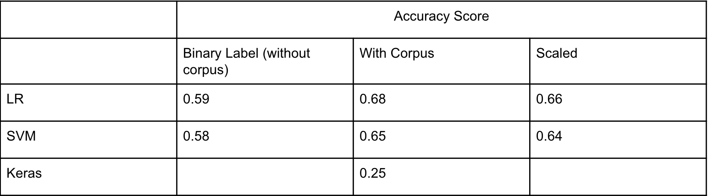
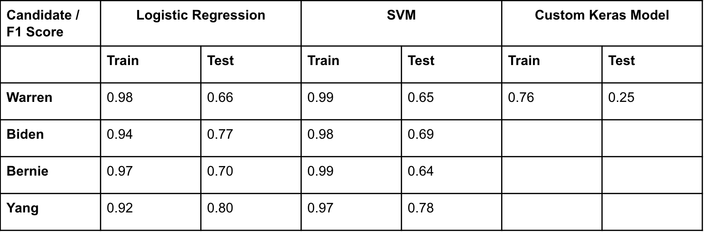
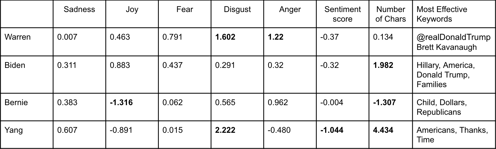

# Predicting Tweet Reach of Select 2020 Presidential Candidates Using Sentiment Analysis

## Introduction

*Background:*

Social media usage has increasingly become a daily part of our lives. It played a significant role in the 2016 Presidential election Both campaigns spent a combined $81 million on Facebook advertisements[5]. A good amount of political messaging is negative Of 69,500 ads between November 1-5 2016, 92% had either negative messages or focused on differences between the candidates. 
Only 3% focused on positive messages about Clinton, and 5% focused on positive messages about Trump[1]. Trump was accused of negative rhetoric but still won in 2016. 

Was he was elected despite his negativity or did it actually help his campaign?

*Problem Overview:*

With the 2020 election coming up, there is plenty of data being generated by politicians that is available to analyze.
Goal: Find out if negative messaging is an effective campaign strategy
The question we wish to answer is, “Do negative tweets by Presidential candidates spread further than positive tweets?”
This will help us to determine whether a negative or positive tweet by a candidate, and by extension a negative or positive campaign, resonates more with the American people.

*Related Work:*

Hamlin and Agrawal collected tweets that mentioned one of the candidates, sorted by state, sentiment analysis to classify these tweets as positive or negative to the candidate. [7]
They used sentiment percentage of the candidate per state to predict winner of that state.

Joyce and Deng conducted Sentiment analysis and correlated sentiment data with national opinion polls[8]
Heredia et al. trained a convolutional neural network to determine sentiment and predicted the electoral college winner from the percentage of positive tweets per candidate in each state [9]

*Difference from our work:*

These methods used sentiment analysis on voter tweets to predict election winner.
We are using sentiment analysis on candidate tweets to predict the reach of the tweet.

## Data

We collected tweets from four Democratic Presidential Candidates: Bernie Sanders, Joe Biden, Elizabeth Warren, and Andrew Yang
We ignored the 1,000 most recent tweets taken for analysis. The older tweets are less likely to appear in users’ feeds, so tweet metrics for them should be stable.

## Methods

We determined the cutoff for “high reach” and “low reach” tweet per candidate.
After determining the cutoff, we conducted a sentiment analysis on tweets using IBM Watson Natural Language Understanding(NLU) APIs
Initially were using NLTK but NLU was much more robust and returned additional information.
We created a function in Python that takes in a list of tweets as an argument, calls the NLU API, and returns a Python dictionary mapping the tweet text to all of the sentiment scores. These results were used to train our models.

We then created a classification model per candidate to specifically see the impact a tweet’s sentiment has on its reach and control for confounding variables.
We created four matrices per candidate from the sentiment analysis results: an emotion matrix, a keyword matrix, a sentiment matrix, and a character matrix. 
emotion matrix: the probability values that the tweet is expressing anger, disgust, fear, joy, and sadness. 
keyword matrix: a one-hot like encoding of relevance values from 0 to 1 for each keyword in the tweet. 
sentiment matrix: contains a sentiment score per tweet, from -1 to 1. 
character matrix: the number of characters per tweet. 
Each of these matrices were combined per candidate, ultimately creating 4 feature matrices to be plugged into the model.

Next, we evaluated multiple models using the same features and performed classification using these models. 
Logistic Regression, Support Vector Machines (SVM), and Keras Deep Learning were the algorithms we tried for this.
We initially were using 3 labels and classifying tweets as high, medium and low reach, however the model accuracy did not go above 44% when doing so. As a result we decided to use only 2 labels, high and low reach, and conduct binary classification instead.

## Results

For each model, just used sentiment and emotion without corpus as a baseline, then we tested each with corpus and then with scaled inputs

Without Corpus: Subject matter and keywords ignored, find the direct effect sentiment and emotion had on reach.
Certain keywords had a larger coefficient in the model than our sentiment (Ex, Warren using “Brett Kavanaugh”)

With Corpus: Accounted for certain keywords in addition to sentiment and emotion
Increased accuracy of our results

Scaled Inputs: Scaling the inputs of the model using standard scaling. 
Had no effect on results
We ultimately decided on using binary labeling with Corpus.

Logistic Regression provided the best test f1 scores across the board.

Sentiment score has a negative coefficient, meaning that tweets with positive sentiment values have a lower probability of becoming high reach than those in the reference group.
Sadness, Disgust, Fear have a positive coefficient across the board.
Yang has “thanks” as one of his most effective keywords, and it was also prominent on his word cloud.

## Conclusion

Overall, the sentiment scores seem to indicate that negative messaging may lead to higher reach on twitter, however, the coefficient values were not that large.
While playing a significant part, some emotions and sentiment scores did not have as much impact as we had anticipated.
Keywords also played a significant part in determining tweet reach.
More work needs to be done in this area in order to definitively conclude one way or another.

## Authors

Salem Abuammer sabuammer@hawk.iit.edu

Ekrem Guzelyel ekremguzelyel@gmail.com

Muhammad Zubair Shareef msharee3@hawk.iit.edu

## References

[1] Wallace, Gregory(2016, November 8). Negative ads dominate in campaign's final days. CNN. Retrieved from https://www.cnn.com/2016/11/08/politics/negative-ads-hillary-clinton-donald-trump/index.html  
[2] E. Culliford, P. Dave, and A. Rana (2019, October 30 ). Facebook sales grow as users tick up; Zuckerberg defends political ads. Reuters. Retrieved from https://www.reuters.com/article/us-facebook-results/facebook-beats-on-profit-as-costs-grow-slower-shares-rise-idUSKBN1X92H6  
[3] Associated Press(2019, October 24). Weak profit, revenue, overshadow Twitter user growth. The Washington Post Retrieved from  https://www.washingtonpost.com/business/weak-profit-revenue-overshadow-twitter-user-growth/2019/10/24/228632f2-f669-11e9-b2d2-1f37c9d82dbb_story.html  
[4] T. Maglio, and S. Bursch (2019, October 22). Snap Q3 Earnings: Snapchat’s Daily Active Users Rise to 210 Million. Yahoo Entertainment. Retrieved from https://www.yahoo.com/entertainment/snap-q3-earnings-snapchat-daily-202011514.html.  
[5] Open Hearing: Social Media Influence in the 2016 U.S. Election: Hearing Before the Select Committee on Intelligence of the United States Senate. 108th Congress, First Session(2017)  
[6] J.A. Caetano, H.S. Lima, M.F. Santos, H.T Marques-Neto, “Using sentiment analysis to define twitter political users’ classes and their homophily during the 2016 American presidential election”. J Internet Serv Appl. 2018;9:18.  
[7] T. Hamling and A. Agrawal, “Sentiment analysis of tweets to gain insights into the 2016 US election”. Columbia Undergraduate Sci J. 2017;11:34–42.  
[8] B. Joyce and J. Deng, "Sentiment analysis of tweets for the 2016 US presidential election," 2017 IEEE MIT Undergraduate Research Technology Conference (URTC), Cambridge, MA, 2017, pp. 1-4.  
[9]  B. Heredia, J.D. Prusa,  and T.M. Khoshgoftaar, “Location-Based Twitter Sentiment Analysis for Predicting the US 2016 Presidential Election.” The Thirty-First International Flairs Conference, 2018.  
[10] A. Pak and P. Paroubek, “Twitter as a Corpus for Sentiment Analysis and Opinion Mining.” LREc, vol. 10, pp. 1320-1326. 2010.  

